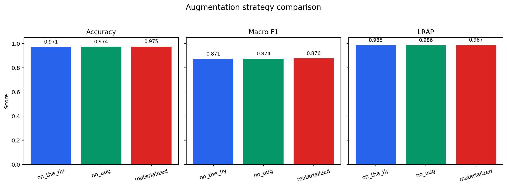
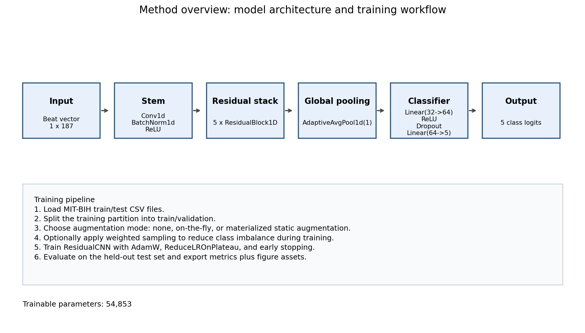

# ECG Arrhythmia Classification


This repository provides a refactored ECG heartbeat classification pipeline built from a previously notebook-driven project. The goal of the refactoring was to turn the project into a cleaner, reusable, and GitHub-ready codebase for five-class arrhythmia classification on MIT-BIH beat-level ECG data.

## Highlights

- Refactored notebook-based workflow into a modular training pipeline
- Supports augmentation ablation with `none`, `on_the_fly`, and `materialized` modes
- Exports reusable experiment artifacts, evaluation reports, and figure assets
- Achieved up to `0.9746` test accuracy and `0.8763` macro F1 in the 50-epoch MPS experiment

## Overview

- Task: five-class heartbeat classification
- Dataset: MIT-BIH beat-level CSV files
- Input length: `187`
- Model: refactored 1D CNN inspired by the referenced heartbeat classification architecture
- Training entry point: `python -m ecg_classification.train`

Expected dataset files:

- `data/mitbih/mitbih_train.csv`
- `data/mitbih/mitbih_test.csv`

## Result Snapshot

The best-performing configuration in the current report used `materialized augmentation` and produced the following test-set results:

| Accuracy | Macro F1 | LRAP | Ranking loss | Coverage error |
|---:|---:|---:|---:|---:|
| `0.9746` | `0.8763` | `0.9866` | `0.0077` | `1.0310` |

Representative comparison figure:

<p align="center">
  
</p>

*Figure. Comparison of the three augmentation settings across the main test metrics.*

Representative method figure:

<p align="center">
  
</p>

*Figure. Refactored 1D CNN architecture and end-to-end training workflow, adapted from the referenced heartbeat classification model.*

Detailed analysis is available in [docs/report.md](docs/report.md).

## Classes

| Label | Symbol | Class name |
|---:|:---:|---|
| 0 | N | Normal beat |
| 1 | S | Supraventricular ectopic beat |
| 2 | V | Ventricular ectopic beat |
| 3 | F | Fusion beat |
| 4 | Q | Unknown or unclassifiable beat |

Readable class names are used throughout the refactored codebase and evaluation outputs.

## Repository Structure

```text
ecg_classification/
├── augment.py     # Signal augmentation utilities
├── constants.py   # Label names, symbols, and shared constants
├── data.py        # CSV loading, split logic, dataset, and sampler
├── figures.py     # EDA, method, and result figure generation
├── metrics.py     # Evaluation metrics, reports, and plots
├── model.py       # Residual 1D CNN definition
├── train.py       # Training entry point
└── utils.py       # Runtime and helper utilities

notebooks/
└── JM_Source_Code_refactored.ipynb

docs/
└── report.md      # Experiment report
```

## What This Repository Includes

- modularized training and evaluation code
- readable class mapping and cleaner outputs
- augmentation ablation with `none`, `on_the_fly`, and `materialized` modes
- saved experiment artifacts and publication-friendly figures
- a separate experiment report in [docs/report.md](docs/report.md)

## Installation

```bash
python3 -m venv .venv
source .venv/bin/activate

python -m pip install --upgrade pip setuptools wheel
python -m pip install -e .
python -m pip check
```

## Training

Run a short smoke test:

```bash
python -m ecg_classification.train \
  --epochs 3 \
  --batch-size 256 \
  --output-dir outputs/smoke_run
```

Run the default baseline:

```bash
python -m ecg_classification.train \
  --epochs 50 \
  --batch-size 256 \
  --output-dir outputs/baseline_run
```

Run the same setting without augmentation:

```bash
python -m ecg_classification.train \
  --epochs 50 \
  --batch-size 256 \
  --disable-augmentation \
  --output-dir outputs/baseline_run_no_aug
```

Run with materialized augmentation:

```bash
python -m ecg_classification.train \
  --epochs 50 \
  --batch-size 256 \
  --augmentation-mode materialized \
  --materialized-copies-per-sample 1 \
  --output-dir outputs/baseline_run_static_aug
```

The training script automatically uses `cuda`, `mps`, or `cpu` depending on availability.

## Figure Generation

Generate EDA, method, and result figures from a completed run:

```bash
python -m ecg_classification.figures \
  --run-dir outputs/baseline_run \
  --output-dir docs/assets
```

Generate comparison figures across multiple runs:

```bash
python -m ecg_classification.figures \
  --run-dir outputs/baseline_run \
  --output-dir docs/assets \
  --compare-run on_the_fly outputs/baseline_run \
  --compare-run no_aug outputs/baseline_run_no_aug \
  --compare-run materialized outputs/baseline_run_static_aug
```

Generated figures include:

- class distribution and representative beat examples
- augmentation before/after visualization
- model and pipeline summary figure
- confusion matrix and learning curves
- augmentation comparison chart

## Output Artifacts

Each training run writes the following files:

- `best_model.pt`
- `history.csv`
- `config.json`
- `metrics.json`
- `classification_report.txt`
- `confusion_matrix.png`
- `learning_curves.png`

`metrics.json` includes:

- `loss`
- `accuracy`
- `macro_f1`
- `label_ranking_average_precision`
- `label_ranking_loss`
- `coverage_error`

## Documentation

- Repository overview and usage: this `README.md`
- Experimental results and interpretation: [docs/report.md](docs/report.md)

## References

If you use this project or build on the dataset and model background, the following references are relevant:

1. Kachuee M, Fazeli S, Sarrafzadeh M. *ECG Heartbeat Classification: A Deep Transferable Representation*. 2018 IEEE International Conference on Healthcare Informatics Workshops (ICHI-W), 2018. IEEE Xplore: https://ieeexplore.ieee.org/document/8419425 . arXiv: https://arxiv.org/pdf/1805.00794
2. Moody GB, Mark RG. *The Impact of the MIT-BIH Arrhythmia Database*. IEEE Engineering in Medicine and Biology Magazine. 2001;20(3):45-50. DOI: `10.1109/51.932724`. PubMed: https://pubmed.ncbi.nlm.nih.gov/11446209/
3. Goldberger AL, Amaral LAN, Glass L, et al. *PhysioBank, PhysioToolkit, and PhysioNet: Components of a New Research Resource for Complex Physiologic Signals*. Circulation. 2000;101(23):e215-e220. PubMed: https://pubmed.ncbi.nlm.nih.gov/10851218/
4. MIT-BIH Arrhythmia Database. PhysioNet dataset page: https://physionet.org/content/mitdb/1.0.0/ . Dataset DOI: https://doi.org/10.13026/C2F305
