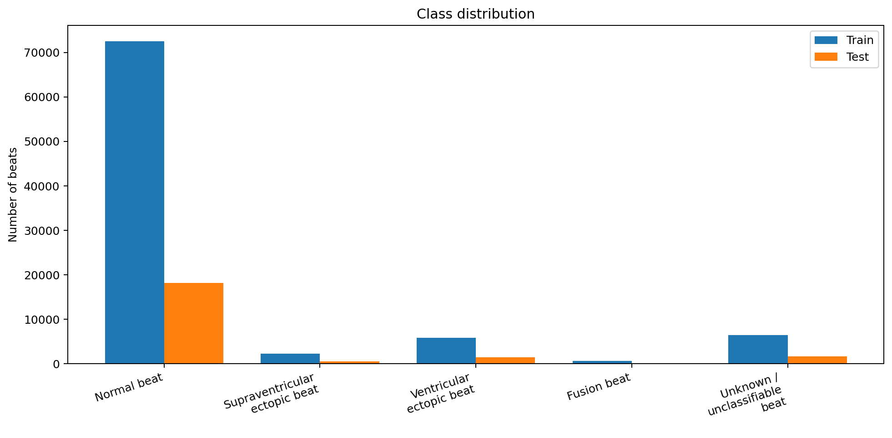
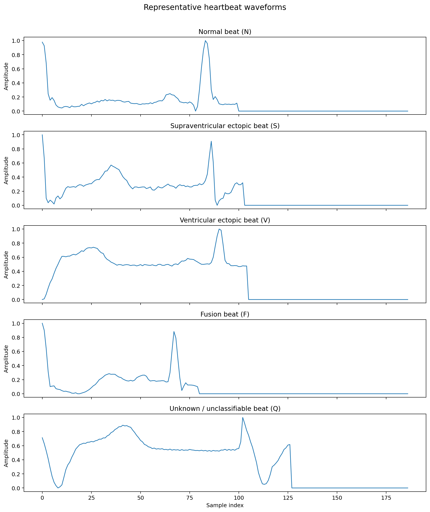
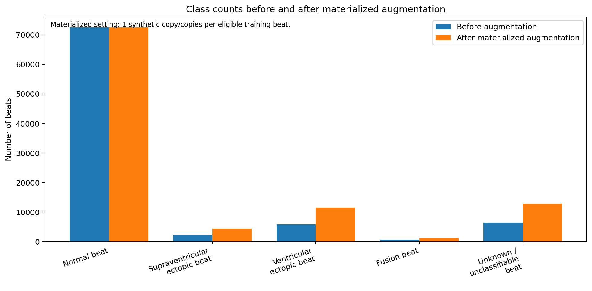
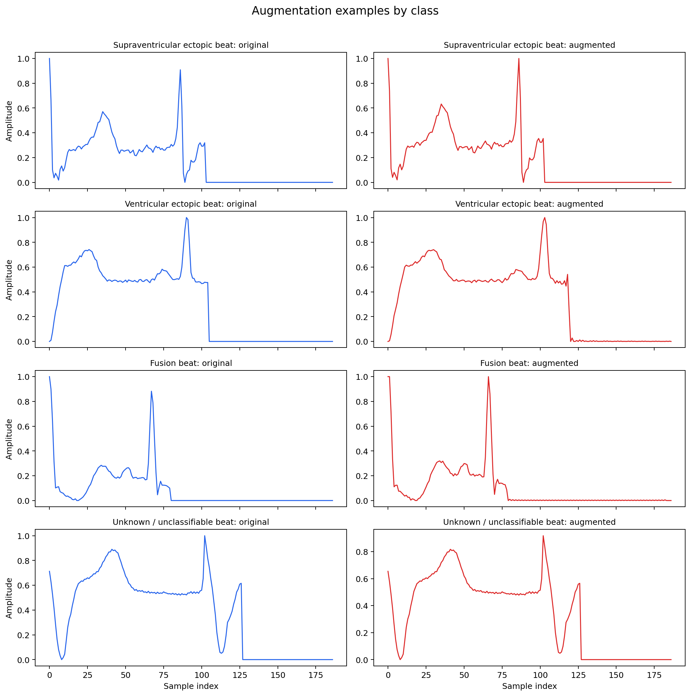
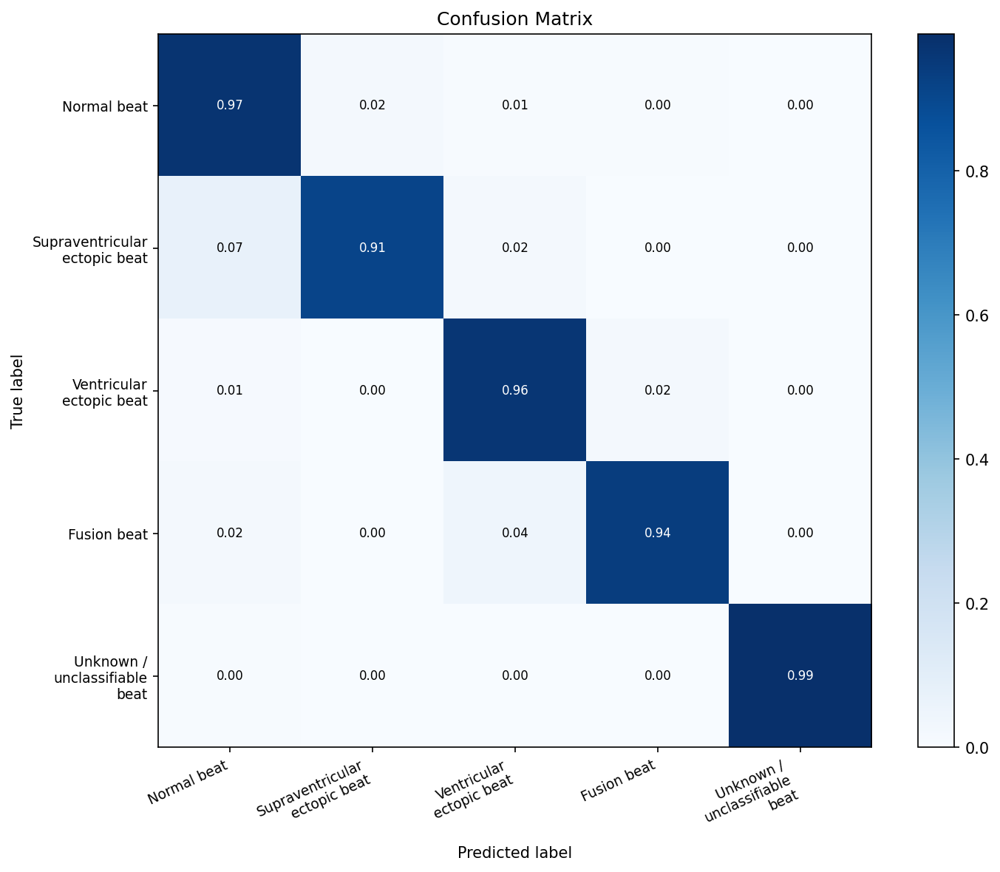
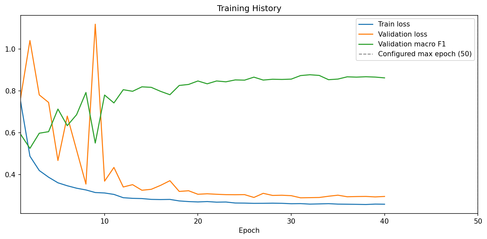
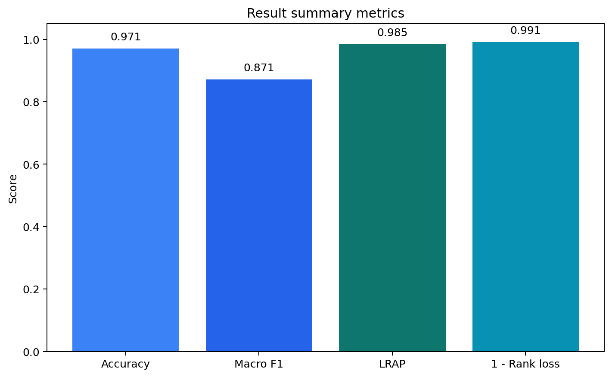

# Experiment Report

## Abstract

This report presents the results of a refactored ECG arrhythmia classification pipeline for five-class heartbeat recognition on MIT-BIH beat-level data. The original notebook-centered workflow was reorganized into a reusable research codebase with modular training, augmentation ablation, artifact export, and figure generation. Three augmentation settings were evaluated for 50 epochs on Apple Silicon with PyTorch `MPS`: no augmentation, on-the-fly augmentation, and materialized augmentation. All settings achieved strong performance above `0.97` test accuracy. The best result was obtained with materialized augmentation, reaching `0.9746` accuracy, `0.8763` macro F1, and `0.9866` label ranking average precision. The experiments show that the refactored pipeline is stable and reproducible, while also providing clearer support for class-imbalance analysis and GitHub-ready documentation.

**Keywords:** ECG classification, arrhythmia detection, MIT-BIH, deep transferable representation, data augmentation, PyTorch

## 1. Introduction

Electrocardiogram classification is a common benchmark task in biomedical machine learning, particularly for arrhythmia detection under strong class imbalance. This project focuses on five-class heartbeat classification using beat-level ECG segments from the MIT-BIH Arrhythmia Database.

The main contribution of the present work is not a new model family, but the refactoring of a previously notebook-driven implementation into a reusable and report-oriented codebase. The refactored system separates data loading, augmentation, model definition, training, evaluation, and figure generation into maintainable modules while preserving the original problem setting.

The five target classes are:

- Normal beat
- Supraventricular ectopic beat
- Ventricular ectopic beat
- Fusion beat
- Unknown or unclassifiable beat

The model design is informed by the heartbeat classification architecture proposed in *ECG Heartbeat Classification: A Deep Transferable Representation* [1]. The current implementation preserves the overall 1D residual heartbeat-classification design while introducing practical modifications in normalization, regularization, and classifier-head structure as part of the refactoring process. The dataset foundation follows the MIT-BIH Arrhythmia Database [2], the broader PhysioNet resource [3], and the MIT-BIH dataset distribution page hosted by PhysioNet [4].

## 2. Data and Method

### 2.1 Dataset

The experiments use `data/mitbih/mitbih_train.csv` and `data/mitbih/mitbih_test.csv`. Each heartbeat is represented as a vector of length `187`. A validation subset corresponding to `10%` of the training split is used during optimization.

The class distribution is highly imbalanced, with the majority of samples belonging to the normal-beat class. This imbalance motivates both weighted sampling and augmentation-based comparison.

Figure 1 illustrates the original class distribution of the training split.

  

*Figure 1. Original class distribution of the MIT-BIH training split, showing the dominance of normal beats over minority arrhythmia classes.*

Figure 2 shows representative heartbeat waveforms from the five target classes.

  

*Figure 2. Representative beat waveforms for the five heartbeat classes used in the classification task.*

### 2.2 Model

The classifier is a refactored 1D convolutional neural network with residual connections, implemented in `ecg_classification/model.py`. The network receives a single heartbeat waveform and outputs one of the five target labels.

Figure 3 summarizes the refactored model structure and training flow.

  

*Figure 3. Overview of the refactored 1D CNN architecture with residual connections and the training pipeline used in the present implementation.*

### 2.3 Augmentation strategy

The refactored pipeline supports three augmentation modes:

- `none`
- `on_the_fly`
- `materialized`

The augmentation module applies time stretching, amplitude scaling, and Gaussian noise injection.

On-the-fly augmentation transforms a sample only when it is fetched during training. As a result, it increases the diversity of the observed training distribution across epochs, but it does not create a fixed enlarged dataset. Materialized augmentation, in contrast, generates synthetic beats before training and appends them to the training split, making the expanded sample counts explicit and directly reportable.

In the current materialized setting, one augmented copy was added for each selected minority-class sample.

Figure 4 shows the class-count change under materialized augmentation.

  

*Figure 4. Class counts before and after materialized augmentation, where minority classes are expanded while the majority normal-beat class is left unchanged.*

Figure 5 visualizes waveform-level changes introduced by augmentation.

  

*Figure 5. Example heartbeat waveforms before and after augmentation, illustrating the morphological variation introduced by the augmentation module.*

Table 1 reports the effective class counts used in the materialized setting.

| Class | Original train count | Materialized train count |
|---|---:|---:|
| Normal beat | `65223` | `65223` |
| Supraventricular ectopic beat | `2001` | `4002` |
| Ventricular ectopic beat | `5209` | `10418` |
| Fusion beat | `577` | `1154` |
| Unknown or unclassifiable beat | `5788` | `11576` |

*Table 1. Training-set class counts before and after materialized augmentation.*

## 3. Experimental Setup

Three 50-epoch runs were executed on Apple Silicon using PyTorch `MPS`:

- `outputs/baseline_run`
- `outputs/baseline_run_no_aug`
- `outputs/baseline_run_static_aug`

Shared hyperparameters were:

- batch size: `256`
- learning rate: `0.001`
- weight decay: `0.0001`
- patience: `8`
- weighted sampler: enabled
- label smoothing: `0.05`
- device: `mps`

The evaluation pipeline reports loss, accuracy, macro F1, label ranking average precision, label ranking loss, coverage error, confusion matrices, and class-wise reports.

## 4. Results

### 4.1 Overall performance

Table 2 summarizes the final test-set performance across the three augmentation settings.

| Setting | Accuracy | Macro F1 | LRAP | Ranking loss | Coverage error |
|---|---:|---:|---:|---:|---:|
| On-the-fly augmentation | `0.9709` | `0.8714` | `0.9847` | `0.0086` | `1.0343` |
| No augmentation | `0.9736` | `0.8736` | `0.9860` | `0.0082` | `1.0327` |
| Materialized augmentation | `0.9746` | `0.8763` | `0.9866` | `0.0077` | `1.0310` |

*Table 2. Final test-set comparison of the three augmentation settings.*

All three settings achieved strong performance, with test accuracy above `0.97`. Materialized augmentation produced the best overall result, although the margin over the no-augmentation setting remained modest.

Figure 6 compares the three runs across the main metrics.

  

*Figure 6. Test-set comparison of on-the-fly augmentation, no augmentation, and materialized augmentation across the main evaluation metrics.*

### 4.2 Best-performing configuration

The best-performing run was `outputs/baseline_run_static_aug`, which achieved:

- accuracy: `0.9746`
- macro F1: `0.8763`
- LRAP: `0.9866`
- ranking loss: `0.0077`
- coverage error: `1.0310`

These results indicate that explicit minority-class expansion can provide a small but consistent benefit when the training budget is sufficiently large.

### 4.3 Class-wise performance

Table 3 reports the per-class performance of the best-performing materialized augmentation run.

| Class | Precision | Recall | F1-score | Support |
|---|---:|---:|---:|---:|
| Normal beat | `0.9965` | `0.9761` | `0.9862` | `18118` |
| Supraventricular ectopic beat | `0.6751` | `0.9083` | `0.7745` | `556` |
| Ventricular ectopic beat | `0.9444` | `0.9627` | `0.9535` | `1448` |
| Fusion beat | `0.5272` | `0.9568` | `0.6798` | `162` |
| Unknown or unclassifiable beat | `0.9822` | `0.9932` | `0.9876` | `1608` |

*Table 3. Class-wise performance of the best-performing materialized augmentation run.*

Performance was strongest for `Normal beat`, `Ventricular ectopic beat`, and `Unknown or unclassifiable beat`. For the smallest classes, recall remained high while precision was comparatively lower, indicating that the classifier was sensitive to minority-class patterns but still prone to over-predicting them.

Figure 7 provides the confusion matrix used for class-wise error analysis.

  

*Figure 7. Confusion matrix of the trained classifier, showing strong recognition of major classes and remaining confusion in minority arrhythmia categories.*

### 4.4 Training behavior

The three runs reached their best validation macro F1 at nearby epochs:

- `outputs/baseline_run`: best epoch `32`, validation macro F1 `0.8773`
- `outputs/baseline_run_no_aug`: best epoch `31`, validation macro F1 `0.8878`
- `outputs/baseline_run_static_aug`: best epoch `33`, validation macro F1 `0.8854`

Although the no-augmentation setting achieved the highest validation macro F1, the materialized augmentation run yielded the best final test-set performance. This suggests a small generalization gain from explicit minority-class expansion rather than a dramatic shift in optimization behavior.

Figure 8 shows the learning curves of the baseline run, and Figure 9 summarizes the final metric values. Although the experiment budget was configured for `50` epochs, the plotted curve ends earlier because training was stopped automatically by early stopping once validation macro F1 stopped improving within the configured patience window.

  

*Figure 8. Training and validation learning curves for a run configured with a maximum of 50 epochs; the curve ends earlier because early stopping terminated training after convergence.*

  

*Figure 9. Compact summary of the final evaluation metrics obtained from the trained classifier.*

## 5. Discussion

The experiments support three main conclusions. First, the refactored pipeline is stable and reproducible across multiple augmentation settings. Second, augmentation should be interpreted differently depending on implementation mode: on-the-fly augmentation increases training diversity, whereas materialized augmentation creates a fixed and reportable expansion of minority-class data. Third, class imbalance remains the main modeling challenge, as minority classes exhibit strong recall but still lower precision than the majority classes.

From a reporting perspective, materialized augmentation is particularly useful because it allows the class-count change to be described rigorously in both EDA and method sections. From a modeling perspective, its benefit in the current study is real but moderate, suggesting that further gains may come from calibration, loss reweighting, or class-specific decision analysis rather than from augmentation alone.

## 6. Conclusion

The final 50-epoch MPS experiments show that the refactored ECG classification pipeline is fully operational and produces strong five-class classification performance on MIT-BIH.

Among the tested settings, materialized augmentation produced the best overall result:

- accuracy: `0.9746`
- macro F1: `0.8763`
- LRAP: `0.9866`
- ranking loss: `0.0077`
- coverage error: `1.0310`

Overall, the refactored project now supports reproducible training, augmentation ablation, figure generation, and report-oriented experimental output within a cleaner research-code structure.

## References

1. Kachuee M, Fazeli S, Sarrafzadeh M. *ECG Heartbeat Classification: A Deep Transferable Representation*. 2018 IEEE International Conference on Healthcare Informatics Workshops (ICHI-W), 2018. IEEE Xplore: https://ieeexplore.ieee.org/document/8419425. arXiv: https://arxiv.org/pdf/1805.00794.
2. Moody GB, Mark RG. *The Impact of the MIT-BIH Arrhythmia Database*. IEEE Engineering in Medicine and Biology Magazine. 2001;20(3):45-50. DOI: 10.1109/51.932724.
3. Goldberger AL, Amaral LAN, Glass L, Hausdorff JM, Ivanov PC, Mark RG, Mietus JE, Moody GB, Peng CK, Stanley HE. *PhysioBank, PhysioToolkit, and PhysioNet: Components of a New Research Resource for Complex Physiologic Signals*. Circulation. 2000;101(23):e215-e220.
4. MIT-BIH Arrhythmia Database. PhysioNet. Available at: https://physionet.org/content/mitdb/1.0.0/ . DOI: 10.13026/C2F305.
