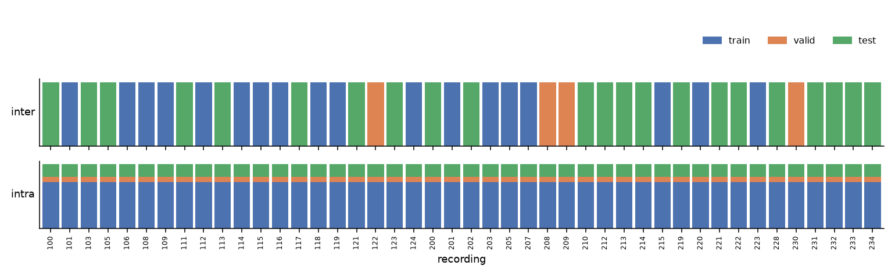
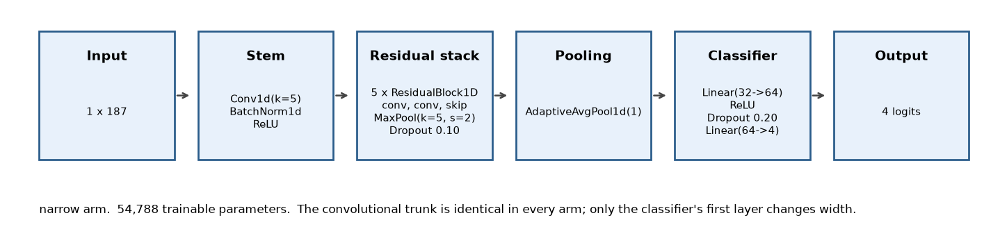
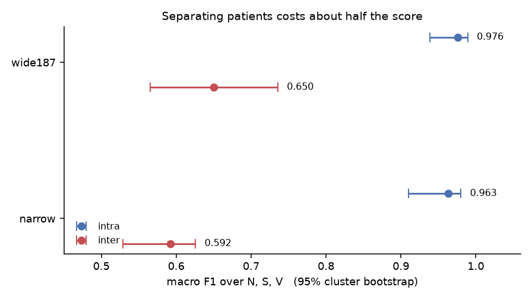
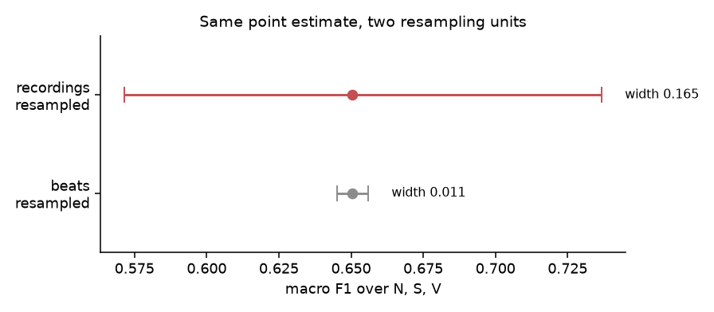
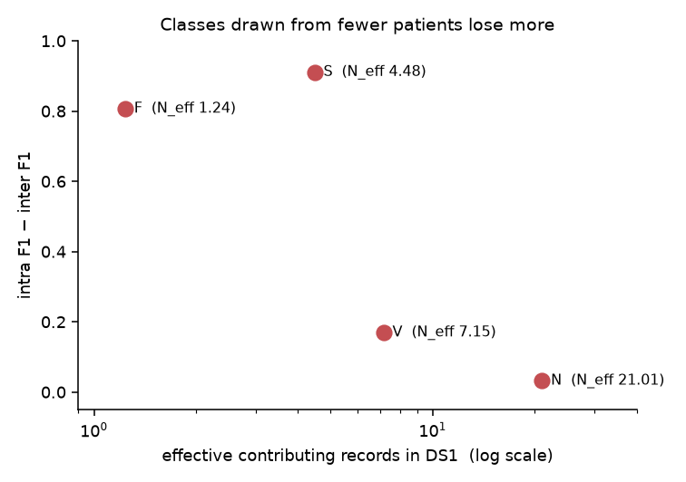
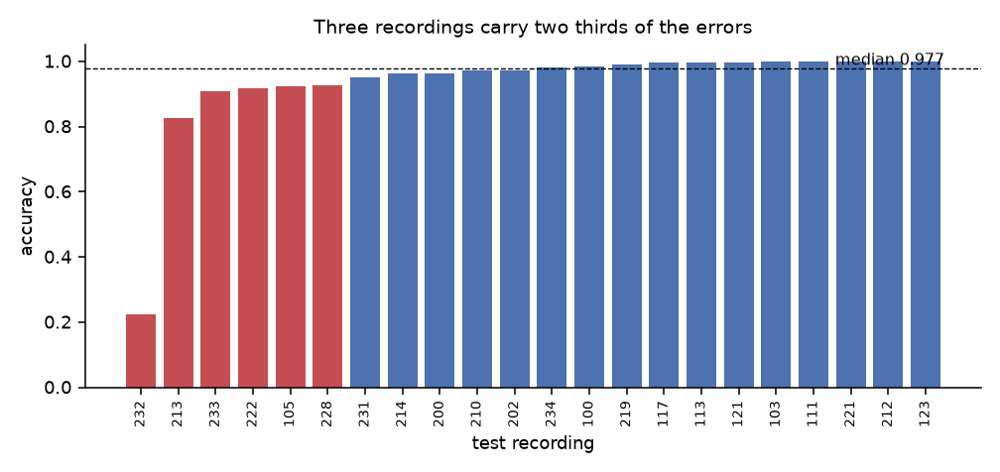
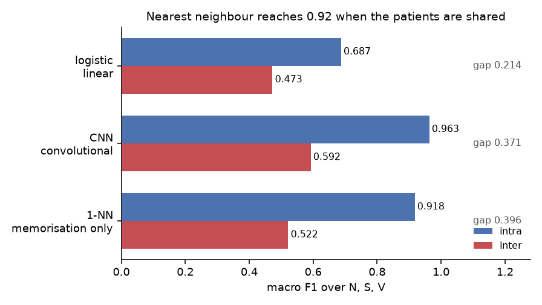
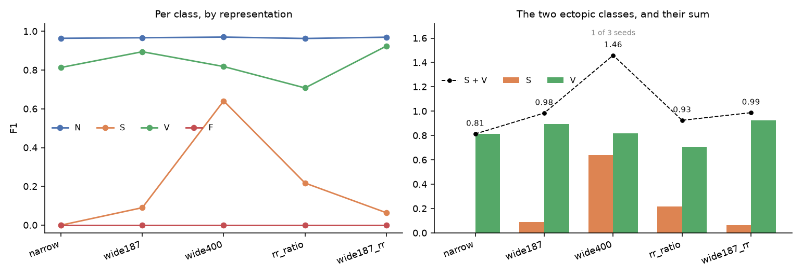
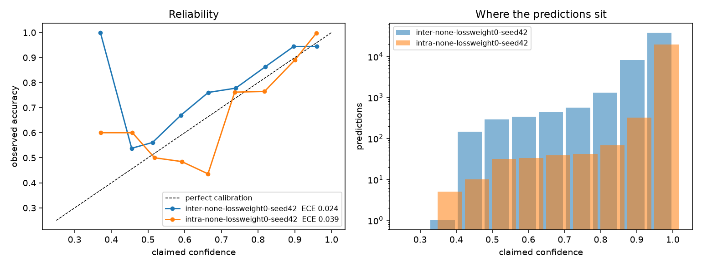

# Measuring the Inter-Patient Penalty in MIT-BIH Heartbeat Classification

> **v0.2.0.** Every figure and interval is generated from the artefacts of the runs described here; see `analysis/` for the code that produces them.

## Abstract

That patient-level evaluation is harder than beat-level evaluation has been known since de Chazal et al. established the DS1/DS2 partition in 2004 [2]. This study asks not how much harder, but whether the tools ordinarily used can measure it.

An earlier version of this project used a preprocessed CSV release of MIT-BIH and reported 0.9746 accuracy. That file discards record identifiers and splits at the beat level, so patient-level evaluation is not merely absent but impossible. The pipeline was rebuilt from the raw records, reproducing the published DS1/DS2 class counts to within 39 beats in 100,733.

Separating patients costs about half the macro F1 — 0.592 against 0.963 over the three scoreable classes, with cluster bootstrap intervals that do not overlap. The loss is not uniform: normal beats lose 0.03 and ventricular 0.17, while supraventricular and fusion fall to zero. Minority classes are nested inside a handful of recordings — the effective number of contributing records, by inverse Simpson index, is 21.0 for normal beats and 1.24 for fusion — and the per-class penalty orders inversely with that count.

Three findings concern measurement. Beats are clustered within recordings at an intraclass correlation of 0.35, giving a design effect of 795 and an effective sample size of 64 from 49,660 beats; beat-level intervals are 24 times too narrow on accuracy, a factor the design effect predicts to within 16%. A beat-level split hides the structure that inflates it, the same correlation reading 0.013 under that protocol. And aggregate calibration hides where the model fails: an expected calibration error of 0.024 overall against 0.725 on the recording handled worst, where the model claims 0.949 confidence at 0.224 accuracy.

Consequently no intervention could be shown to help. Five rebalancing strengths, an oversampler, five representation arms and three learning rates were compared; every difference fell inside the record-level interval, and two hypotheses stated in advance were refuted. Twenty-two recordings are not enough to distinguish these interventions, and the interval that shows this is the one that shows the protocol gap to be real.

**Keywords:** ECG classification, MIT-BIH, inter-patient evaluation, cluster bootstrap, design effect, class-patient nesting, AAMI EC57

---

## 1. Introduction

### 1.1 The task, and what prompted the rebuild

A beat classifier has to separate a pathological signal from patient-specific nuisance variation: amplitude varies with thoracic impedance and cardiac axis, intervals with resting heart rate. Every normalisation step here is an attempt to divide the two. What this study finds is that when classes are nested inside patients the division becomes impossible in principle — for a class whose beats come from one recording there is no sample against which to distinguish that patient's pathology from that patient's idiosyncrasy.

The predecessor to this report used a public preprocessed release of MIT-BIH, each row holding 187 signal samples and one label. Two properties motivated the rebuild: there is **no record identifier**, so a patient-disjoint split cannot be constructed after the fact; and the train-test ratio is **exactly 80:20**, which a patient-wise partition of unequally sized recordings cannot produce.

This is not unusual, and the field has known it for some time [8]. A 2025 systematic review reports that of 122 ECG classification studies published between 2017 and 2024, 96 used MIT-BIH, 68 followed the AAMI recommendations, and **37 — under a third — adopted the inter-patient paradigm** [9]. The protocol has been available since 2004.

### 1.2 What this work does and does not claim

It does not replace an intra-patient evaluation with an inter-patient one and declare the former invalid. It makes the choice an experimental factor and measures its consequence, holding preprocessing, architecture and augmentation fixed. The earlier CSV result is excluded from that comparison because it differs in four respects at once and cannot be attributed to any one (Appendix A).

It also improves nothing. No configuration classified supraventricular or fusion beats reliably. That is reported as the result it is, together with the interval explaining why a reliable improvement could not have been recognised here even if one had been found.

### 1.3 Contributions

- A pipeline rebuilt from raw WFDB records preserving every beat's recording identity, validated against published DS1/DS2 counts.
- A controlled measurement of the protocol gap, decomposed by class, with the decomposition explained by two independent mechanisms.
- A quantification of class-patient nesting, and the observation that the per-class penalty orders inversely with it.
- Intraclass correlation and design effect for this task, validated on accuracy and used to justify the resampling unit.
- A capacity axis — nearest neighbour, linear, convolutional — showing that most of what a beat-level split measures is retrievable rather than learned.
- Two hypotheses stated in advance, tested, and refuted.

---

## 2. Data

### 2.1 Records and classes

Records are read from the MIT-BIH Arrhythmia Database [4, 5, 6] via WFDB, the MLII channel selected **by name**, which handles record 114 — whose signals are reversed — without a special case. Following AAMI EC57 [7] as described in [2] and [9], the four recordings with paced beats (102, 104, 107, 217) are excluded, leaving 44; records 102 and 104 have no MLII channel in any case. The same recommendation covers ventricular flutter: flutter waves carry the annotation `!`, which belongs to no AAMI superclass and is dropped during segmentation with the other non-beat annotations — 472 of them from record 207. This is exclusion by symbol rather than by segment, so a beat annotated normal or ventricular inside a flutter episode would remain.

Once the paced recordings are gone the Q class retains only the literal `Q` annotation: **15 beats database-wide**, all artefact. The model therefore has a four-unit head, departing from de Chazal et al., who classified into all five AAMI classes, and following a practice common in later inter-patient work [10].

The exclusion is verified rather than argued. Running the same configuration with Q as a fifth output moves the macro F1 over the three supported classes from 0.5924 to 0.5920, and Q itself scores 0.000. The 15 beats are kept as an **observation set**, never trained on, validated on or scored, but passed through the trained model (§4.9).

### 2.2 Preprocessing

**Table 1.** Preprocessing, and the reason for each choice.

| Step | Choice | Rationale |
|---|---|---|
| Resampling | 360 to 250 Hz, polyphase | 187 samples span 0.748 s, roughly one cardiac cycle; the filter prevents aliasing |
| Window | R peak at index 62; 62 before, 125 after | covers P wave, PR interval, QRS and T wave |
| R peaks | expert annotations | removes detector error as a confounder |
| Normalisation | per-beat median subtraction, then division by the record's IQR | the first absorbs baseline wander; the second removes between-record gain while preserving within-record contrast |
| Boundary beats | dropped, not zero-padded | padding would supply a flat segment that means nothing |

### 2.3 Validation against published counts

**Table 2.** 100,694 beats across 44 records, against the distribution tabulated in [9].

| Class | Ref. DS1 | Here | Ref. total | Here |
|---|---:|---:|---:|---:|
| N | 45,866 | 45,848 | 90,125 | 90,088 |
| **S** | **944** | **944** | **2,781** | **2,781** |
| V | 3,788 | 3,788 | 7,009 | 7,008 |
| F | 415 | 414 | 803 | 802 |
| **Q** | **8** | **8** | **15** | **15** |
| total | 51,021 | 51,002 | 100,733 | 100,694 |

Supraventricular and unclassifiable match exactly in both halves; the shortfall of 39 in 100,733 is beats whose window would overrun a record boundary. The AAMI mapping, the exclusions and the partition are thus independently verified.

### 2.4 Class-patient nesting

Frequency understates the problem. With $p_r$ the share of class $c$'s beats from record $r$, and $R_c$ the number of records holding any,

$$
N_{\text{eff}}(c) = \frac{1}{\sum_r p_r^{2}}, \qquad 1 \le N_{\text{eff}}(c) \le R_c
$$

the inverse Simpson index. It equals $R_c$ when the class is spread evenly and falls to 1 when one record supplies all of it. Because MIT-BIH holds one recording per subject, a value of 21.0 means *21 patients contributing equally*.

**Table 3.** Effective number of contributing records per class and half.

| Class | DS1 beats | $N_{\text{eff}}$ | dominant | DS2 $N_{\text{eff}}$ | dominant |
|---|---:|---:|---|---:|---|
| N | 45,848 | 21.01 | 215 (7%) | 20.71 | 212 (6%) |
| V | 3,788 | 7.15 | 208 (26%) | 5.71 | 233 (26%) |
| S | 944 | 4.48 | 209 (41%) | **1.72** | **232 (75%)** |
| F | 414 | **1.24** | **208 (90%)** | **1.15** | **213 (93%)** |

Under the inter-patient protocol the fusion task is *learn from one patient, generalise to one other*, and the supraventricular task is not much better on the evaluation side.

---

## 3. Method

### 3.1 Protocols and representation arms

**Table 4.** The two protocols.

| Protocol | Construction |
|---|---|
| **inter** | de Chazal partition [2]: DS1 (22 records) train, DS2 (22) test; the validation half carved out of DS1 **by record** |
| **intra** | all beats pooled, class-stratified 80:20 at the beat level |

Validation is split by record under `inter` because holding out beats from recordings the model also trains on would reintroduce, at model selection, the leakage the protocol exists to remove. de Chazal et al. likewise separated selection from assessment, using DS1 to choose among twelve configurations; a network trained by gradient descent additionally needs a held-out set during training, so DS1 is divided again. In both arrangements DS2 is untouched until the end.

  

*Figure 1. The 44 recordings under each protocol. Under inter a recording belongs entirely to one side; under intra every recording is cut three ways.*

How much signal the window covers, and whether interval features accompany it, is a factor of the experiment.

**Table 5.** Representation arms.

| Arm | Window | Input | Effective rate | Intervals |
|---|---|---:|---:|:---:|
| `narrow` | 0.248 s before, 0.500 s after | 187 | 250 Hz | no |
| `wide187` | 0.80 s either side | 187 | **117 Hz** | no |
| `wide400` | 0.80 s either side | **400** | 250 Hz | no |
| `rr_ratio` | as `narrow` | 187 | 250 Hz | **yes** |
| `wide187_rr` | as `wide187` | 187 | 117 Hz | **yes** |

At 0.80 s of reach the previous R peak is visible for 98.6% of supraventricular beats against 55.4% of normal ones — the widest separation available — while beats two cycles back stay under 2%. Where the window exceeds the input length it is resampled with a polyphase filter, trading resolution for context; `wide400` holds the same window at full rate and exists to say which of the two mattered.

Four interval features are supplied, all dimensionless: preceding and following interval over the local mean, local mean over the record median, and the ratio of the first two. Absolute intervals are excluded; §4.6 shows why.

### 3.2 Model

A 1D residual CNN. The stem maps one input channel to 32 with a kernel-5 convolution, batch normalisation and ReLU. Five residual blocks follow, each two kernel-5 convolutions with batch normalisation, a skip addition, ReLU, a kernel-5 stride-2 max pool and dropout at 0.10. Global average pooling reduces the sequence to one value per channel, and a two-layer head maps 32 to 64 to the logits with ReLU and dropout at 0.20. **54,788 trainable parameters.** The design follows Kachuee et al. [1], retaining the modifications made in the earlier version of this project.

The pooling bears on §4.6: global average pooling discards *where* a feature occurred, so the network reads the separation between two features but not the absolute position of one.

**No layer, kernel size or channel count was changed in this study.** The convolutional trunk is byte-identical across every arm; in the interval arms only the head's first layer widens, from 32 inputs to 36.

  

*Figure 2. The network, drawn for the narrow arm.*

### 3.3 Augmentation, rebalancing, selection

Three augmentation modes were compared under `narrow`: `none`, `on_the_fly` (eligible beats replaced by a variant, count unchanged) and `materialized` (copies appended, count increased). The first contrast isolates invariance injection at fixed counts; the second additionally changes the class prior. Augmentation is disabled in every arm beyond `narrow`. Two defects in the augmenter were found and fixed during this work; they are described in Appendix B because the lesson generalises: **an augmentation procedure cannot be specified independently of the representation it acts on.**

Class weights are inverse frequency raised to $\beta$. Weighted risk minimisation equals unweighted minimisation under a tilted prior [16]: with $\pi_c$ the class frequencies,

$$
R_w(f) = \sum_c \pi_c w_c \, \mathbb{E}[\ell \mid Y = c]
\propto \sum_c \tilde{\pi}_c \, \mathbb{E}[\ell \mid Y = c],
\qquad \tilde{\pi}_c \propto w_c \pi_c
$$

and $w_c \propto \pi_c^{-\beta}$ gives $\tilde{\pi}_c \propto \pi_c^{1-\beta}$. At $\beta = 1$ the base rate is removed entirely. An oversampler is compared separately; it is not equivalent, since batches acquire a different class composition, changing what the batch-normalisation layers learn, and Adam partially absorbs a large loss coefficient while it does not absorb repeated gradient steps.

Model selection is fixed to N, S and V. Fusion cannot support it: a validation split either takes record 208 — leaving training with about forty fusion beats — or it does not, leaving validation with almost none. Selection is restricted; reporting is not.

### 3.4 Capacity baselines and matrix

Two models bracket the network on identical inputs and splits. **1-nearest neighbour** stores the training set and answers with its closest member: it memorises and does nothing else. **L2-regularised multinomial logistic regression** fits one linear boundary per class and has almost no capacity to memorise. Neither is a competitor; both are instruments for measuring what the network's advantage is made of.

`narrow` carries the full matrix: 3 augmentation modes × 2 protocols × 3 seeds, $\beta = 0$, a 100-epoch budget with early stopping at patience 15. `wide187` and `wide400` add 2 protocols × 3 seeds, the oversampler 3 seeds under `inter`, and `rr_ratio` and `wide187_rr` one seed each. No run stopped at the epoch limit.

### 3.5 Uncertainty

Beats are clustered within recordings, so a bootstrap resampling beats treats correlated observations as independent. Uncertainty is estimated by a **cluster bootstrap** [12]:

| | One resample draws |
|---|---|
| beat-level | 49,660 beats from the 49,660, with replacement |
| **cluster** | **22 recordings from the 22**, with replacement; each drawn recording contributes all of its beats |

The second answers *how would this model do on a different set of patients*; the first answers *how much would the score move if beats were re-drawn from these same twenty-two*, which is not a useful question once those twenty-two have been seen. Two thousand resamples throughout, percentile intervals [15] at the 2.5th and 97.5th, computed by `analysis/bootstrap.py` from the stored prediction tables.

With $Y_{ij}$ the correctness of beat $j$ in recording $i$,

$$
Y_{ij} = \mu + a_i + \varepsilon_{ij}, \qquad
\rho = \frac{\sigma_a^2}{\sigma_a^2 + \sigma_\varepsilon^2}, \qquad
D_{\text{eff}} = 1 + (\bar{m} - 1)\rho, \qquad
n_{\text{eff}} = \frac{n}{D_{\text{eff}}}
$$

with $\rho$ estimated by the method of moments from a one-way random-effects model [14], using the effective group size for unbalanced designs, and $D_{\text{eff}}$ the design effect of Kish [13]. The relation is derived for a **mean** and equal group sizes; §4.2 reports where it holds.

These procedures are standard wherever observations are clustered within patients. The performance summary of the 122 studies in [9] consists of point estimates; we found no interval accompanying any of them there, though that summary is not exhaustive of what those studies report.

The bootstrap resamples rows of a stored prediction table. Nothing is retrained and no models are combined, so it measures uncertainty from the evaluation sample with the model held fixed. Uncertainty from training is measured separately by repeating seeds; the two are not combined (§5.8).

---

## 4. Results

### 4.1 The protocol gap

**Table 6.** Macro F1 over N, S and V, seed 42, with 95% cluster bootstrap intervals.

| Protocol | point | 95% CI | $\rho$ | $n_{\text{eff}}$ |
|---|---:|---|---:|---:|
| **intra** | **0.9632** | [0.9142, 0.9805] | 0.013 | 2,922 |
| **inter** | **0.5924** | [0.5305, 0.6264] | 0.346 | **64** |

The intervals are separated by 0.28. Over three seeds the four-class figures are 0.934 ± 0.009 and 0.450 ± 0.023, a gap of 0.485, holding at 0.462 under `wide187`.

  

*Figure 3. The gap survives the wider window and the intervals do not overlap.*

### 4.2 The recording is the sampling unit

Under `inter`, correctness is clustered at $\rho = 0.352$ with 2,257 beats per recording, giving $D_{\text{eff}} = 795$ and $n_{\text{eff}} = 62$ from 49,660 beats. Fifty thousand beats carry the information of sixty-two independent observations.

**Table 7.** Interval widths under the two resampling units.

| Statistic | beat bootstrap | cluster bootstrap | ratio | $\sqrt{D_{\text{eff}}}$ |
|---|---:|---:|---:|---:|
| **accuracy** | 0.00457 | 0.11097 | **24.27** | **28.20** |
| macro F1 (N/S/V) | 0.0110 | 0.1761 | 16.04 | 28.20 |

The design-effect relation is derived for a mean, and accuracy is a mean: there prediction and observation agree to within 16%. Applied to macro F1 — a ratio of ratios, outside the derivation — it misses by 76%. The validation is the accuracy row; the macro F1 ratio is descriptive. The residual is in the expected direction: group sizes range from 1,517 to 3,361 beats, which the formula does not accommodate.

**This establishes the resampling unit, not the size of the gap**, which is established in §4.1 and survives it.

  

*Figure 4. The same point estimate under two resampling units.*

### 4.3 Per-class decomposition

**Table 8.** Per-class penalty and effective patient count, seed 42, `narrow`.

| Class | intra F1 | inter F1 | penalty | $N_{\text{eff}}$ (DS1) |
|---|---:|---:|---:|---:|
| N | 0.996 | 0.964 | 0.032 | 21.01 |
| V | 0.983 | 0.813 | 0.169 | 7.15 |
| **S** | 0.911 | **0.000** | **0.911** | 4.48 |
| **F** | 0.807 | **0.000** | **0.807** | **1.24** |

Spearman rank correlation between $N_{\text{eff}}$ and penalty is −0.800, and −1.000 under `wide400`. Four points cannot support a p-value; the ordering is the observation.

Two mechanisms produce it. Ventricular beats survive on morphology, having a wide QRS that does not depend on knowing the patient. Supraventricular beats do not: their QRS is normal and they are defined by prematurity, which is why the literature treats them as the class that **requires rhythm as context** [11]. With timing absent from this representation only patient-specific morphology remains — which a beat-level split supplies and a record-level split does not. Fusion beats fail on both counts.

  

*Figure 5. Per-class penalty against the effective number of contributing recordings in DS1.*

### 4.4 Where the penalty sits

Accuracy across the 22 test recordings has a median of 0.977 and a range from 0.224 to 1.000; six exceed 0.99. **Three carry 67% of all errors.**

**Table 9.** The three weakest test recordings.

| Record | n | accuracy | note |
|---|---:|---:|---|
| **232** | 1,780 | **0.224** | 1,382 of its beats (78%) are supraventricular |
| 213 | 3,250 | 0.826 | supplies 93% of DS2's fusion beats |
| 233 | 3,077 | 0.908 | |

The penalty is not a uniform limit of the model but failure on particular patients, and record 232 is a patient whose dominant rhythm has no counterpart in the training half.

  

*Figure 6. Accuracy per test recording, worst first.*

### 4.5 Capacity

**Table 10.** Three models, identical inputs and splits, macro F1 over N/S/V.

| Model | capacity | intra | inter | gap | $\rho$ (inter) |
|---|---|---:|---:|---:|---:|
| **1-NN** | memorisation only | 0.9176 | 0.5219 | **0.396** | **0.418** |
| residual CNN | convolutional | 0.9632 | 0.5924 | 0.371 | 0.346 |
| logistic | linear | 0.6872 | 0.4727 | **0.215** | 0.293 |

The gap orders with capacity, the linear model's being roughly half the network's. The sharper observation is in the intra column: **storing the training set and returning its nearest member reaches 0.918 against the network's 0.963.** Most of what a beat-level split measures is retrievable similarity rather than learned pattern, because the nearest neighbour of a test beat is generally another beat from the same recording. Intraclass correlation orders the same way: the model that only memorises has the highest.

  

*Figure 7. The protocol gap against model capacity.*

### 4.6 Representation

**Table 11.** Per-class F1 (seed 42) and macro F1 by arm, under `inter`.

| Arm | N | S | V | F | macro (4) | macro (N/S/V), 3 seeds |
|---|---:|---:|---:|---:|---:|---|
| `narrow` | 0.964 | 0.000 | 0.813 | 0.000 | 0.4443 | 0.599 ± 0.030 |
| `wide187` | 0.967 | 0.090 | 0.895 | 0.000 | 0.4878 | **0.654 ± 0.004** |
| `wide400` | 0.970 | **0.641** | 0.818 | 0.000 | 0.6070 | 0.701 ± **0.094** |
| `rr_ratio` | 0.963 | 0.217 | 0.708 | 0.000 | 0.4720 | 0.629 (1 seed) |
| `wide187_rr` | 0.970 | 0.064 | 0.924 | 0.000 | 0.4893 | 0.652 (1 seed) |

Crossing window context against explicit intervals, from the four-class column:

$$
\begin{aligned}
\text{intervals alone} &= 0.4720 - 0.4443 = +0.0277 \\
\text{wider window alone} &= 0.4878 - 0.4443 = +0.0435 \\
\text{both} &= 0.4893 - 0.4443 = +0.0450 \\[2pt]
\text{interaction} &= 0.0450 - 0.0277 - 0.0435 = \mathbf{-0.0262}
\end{aligned}
$$

**The interaction is negative: the two sources of timing are redundant.** Adding intervals to the wider window buys 0.0015 over the window alone.

The per-class view shows substitution rather than plateau. Across the four grid arms the two ectopic F1 scores sum to 0.813, 0.985, 0.925 and 0.988 — the split moves freely while the total does not. Prematurity is a property both share, at normalised ratios of 0.763 and 0.733 (§4.11), so a network handed timing learns that a beat is ectopic without learning which kind, and assigns it to whichever is four times more common in training.

**`wide400` is the exception at 1.459, and does not survive its seeds.** Supraventricular F1 reads 0.641, 0.071 and 0.075 across three; the arm's standard deviation is 25 times `wide187`'s. In the seed that succeeded, record 232 — 75% of DS2's supraventricular beats — was classified at 0.889 against 0.000 elsewhere.

For scale, de Chazal et al. report a supraventricular sensitivity of 75.9% at a positive predictivity of 38.5% [2]. Inter-patient F1 for that class is 60.74% for an SVM ensemble and 73.06% for a random forest using normalised R–R intervals and QRS-width features [10], and 0.74 for a random forest given a CNN-derived rhythm context feature [11]. Ventricular performance here is comparable to those; the best supraventricular arm reaches 0.641 in one seed and 0.26 over three. All three of those classifiers use interval features; two use more than one lead.

  

*Figure 8. Per-class F1 by arm and the sum of the two ectopic classes.*

### 4.7 Rebalancing

**Table 12.** Loss-weight exponent sweep, `inter`, seed 42.

| $\beta$ | weight ratio | train acc | macro F1 (4-class) |
|---:|---:|---:|---:|
| 0 | 1.0 | 0.977 | **0.450** |
| 0.5 | 9.9 | 0.971 | 0.449 |
| 0.75 | 31.3 | 0.884 | 0.391 |
| **1.0** | **98.4** | **0.118** | **0.220** |

At $\beta = 1$ — plain inverse frequency — training collapses within an epoch. Equalising each class's total loss contribution means 414 fusion beats carry the weight of 40,753 normal ones, and since those 414 come from essentially one patient the network cannot learn to discriminate them; predicting the rare classes indiscriminately becomes the faster way to reduce the weighted loss. No exponent improves on zero. **How much rebalancing a dataset tolerates is itself a measurement of how deeply its classes are nested.**

### 4.8 Two refuted hypotheses

**Post-hoc prior correction.** The tilt is a known quantity and can be undone at prediction time: $p_\beta(c \mid x) \propto p_{\text{model}}(c \mid x) / \tilde{\pi}_c^{\beta}$. The hypothesis, stated before the test, was that the oversampler's advantage was a threshold shift, so applying this to the unweighted model's stored probabilities should recover it. It does not: macro F1 decreases monotonically from 0.444 at $\beta = 0$ to 0.225 at $\beta = 1.25$, and supraventricular F1 never exceeds 0.084. Prior correction is a monotone transformation and can only redistribute decisions along an existing ranking; in the unweighted model the supraventricular score is almost always below the normal score, and no threshold recovers a separation that is not there.

**Oversampling raises the ceiling.** One run supported it: under `wide187`, seed 42, the sampler reached 0.671 against 0.650 unweighted. Two further seeds removed the effect.

**Table 13.** Oversampling against an unweighted loss, `wide187`, `inter`.

| | n | macro F1 (N/S/V) | seeds |
|---|---:|---|---|
| unweighted | 3 | **0.6544 ± 0.0037** | 0.6505, 0.6548, 0.6579 |
| oversampled | 3 | 0.6498 ± **0.0272** | 0.6705, 0.6190, 0.6598 |

The mean is marginally lower and the standard deviation **7.3 times larger**. The nesting structure predicts this: oversampling a class replicates the few recordings supplying it, so the outcome depends on which survived the validation split. It does not add patient diversity; it amplifies dependence on what is there. Pairing the best representation with the best procedure compounds nothing — `wide187_rr` with oversampling reaches 0.578, below every other configuration including the baseline, normal recall falling to 0.797.

### 4.9 Calibration

Aggregate calibration under `inter` looks unremarkable: mean confidence 0.9343 against accuracy 0.9333, an expected calibration error of 0.024. Per recording it does not.

**Table 14.** Calibration extremes across the 22 test recordings.

| Record | n | confidence | accuracy | over | ECE |
|---|---:|---:|---:|---:|---:|
| **232** | 1,780 | **0.949** | **0.224** | **+0.725** | **0.725** |
| 213 | 3,250 | 0.952 | 0.826 | +0.127 | 0.127 |
| 231 | 1,570 | 0.788 | 0.951 | −0.163 | 0.163 |

**The model is most confident where it is least right.** Twenty of the twenty-two recordings are mildly underconfident; record 232 is overconfident by 0.725 and holds 3.6% of the beats, so the aggregate absorbs it entirely.

This matters for a specific reason. In automated Holter analysis, confidence is what routes a beat to human review: low-confidence beats are flagged and high-confidence beats pass through. Record 232 passes through at 0.949 while being right 22% of the time. **The failure is not that the classifier is wrong on this patient but that nothing downstream is told to doubt it.**

The 15 unclassifiable beats, never seen in training, were answered as normal ten times and ventricular five, at a median confidence of 0.895, six above 0.9. Four of the five ventricular calls are transients from record 105, answered at 0.875 to 0.954. Fifteen beats support no estimate, but a classifier that has only seen clean morphology is not hedging when it meets artefact.

  

*Figure 9. Reliability under both protocols, and where the predictions sit.*

### 4.10 What the intervals permit

**Table 15.** Paired cluster-bootstrap comparisons between configurations.

| Comparison | difference | 95% CI |
|---|---:|---|
| `wide187` − `narrow` | +0.067 | [−0.007, +0.159] |
| `wide400` − `wide187` | +0.107 | [−0.072, +0.263] |

Every one contains zero. The supraventricular interval under `wide400` runs from 0.097 to 0.827 — a width of 0.73 against a point estimate of 0.641 — because record 232 supplies 75% of that class in DS2 and is absent from 37% of resamples. The point estimate reports that one patient was classified correctly.

Note the contrast with the seed-level figures: a standard deviation of 0.004 across seeds in the `wide187` arm against a record-level interval width of 0.171 in the same arm. Seed variation measures whether the optimisation is reproducible; record variation measures whether the result is about the model or about which patients were evaluated. **The second is forty times the first, and the convention of reporting several seeds addresses only the first.**

### 4.11 The supraventricular class is not homogeneous in timing

The interval features assume a supraventricular beat is early relative to its patient's own rhythm. Measured per recording, that holds in some and not others.

**Table 16.** Normalised prematurity by recording, selected.

| Record | S beats | S share | **S pre-RR / local mean** | N pre-RR / local mean |
|---|---:|---:|---:|---:|
| 201 | 128 | 6.5% | **0.499** | 1.045 |
| 222 | 209 | 8.4% | 0.637 | 1.007 |
| **232** | **1,382** | **77.6%** | 0.736 | **1.812** |
| 209 | 383 | 12.8% | 0.930 | 1.008 |
| 124 | 31 | 1.9% | 0.996 | 1.001 |
| **207** | 106 | 5.7% | **1.003** | 1.001 |

**Normalised prematurity ranges from 0.499 to 1.003.** In records 207, 124 and 234 these beats are not early at all. The AAMI grouping collects atrial premature, aberrated atrial premature, nodal premature and supraventricular premature beats under one label, and not every member is defined by timing. A feature built on prematurity therefore describes some of the class and not the rest.

A second observation concerns the normalisation. Record 232 is the only recording where normal beats do not read near 1.0; they read 1.812. Its rhythm is 77.6% supraventricular, so the eleven-beat local mean is largely ectopic intervals and the normal beats become outliers against it. **Normalising by a local mean assumes ectopy is the exception; where it is the rule, the reference frame is built from the thing it is meant to contrast against.**

This did not cost accuracy — under `wide400` the model reaches 0.985 recall on that recording's normal beats — so it is not relying on interval features alone. What it costs is the argument of §5.6. The errors there fall as the rest of the study predicts: of 1,382 supraventricular beats, 1,108 are correct, 180 called ventricular and 94 normal, two thirds of the errors going to the other ectopic class in a recording containing no ventricular beats at all.

---

## 5. Discussion

### 5.1 One structure

Class imbalance and patient heterogeneity are usually treated as separate problems. Here they are one: minority-class beats are unevenly nested inside recordings, so any operation on the class axis is also an operation on the patient axis. Oversampling a class replicates a patient; reweighting a loss reweights a patient. $N_{\text{eff}}$ makes the coupling explicit, and it explain why the class ordering of the penalty is not that of the frequencies. The four sections below are four consequences of that one structure.

### 5.2 The structure inflates performance

Separating patients costs 0.485 in macro F1 and the intervals do not overlap. The mechanism is visible in the capacity axis — a nearest-neighbour classifier reaches 0.918 under a beat-level split against the network's 0.963 — and again in the optimisation trace, where the inter-patient runs peak at epoch 9 and the intra-patient runs continue improving past 40. Continuing to fit the training recordings is rewarded when those recordings also furnish the test beats, and paid for when they do not.

### 5.3 The structure conceals itself

This is the finding least likely to be noticed from inside a beat-level evaluation, and it operates at three levels.

| Level | Under `intra` | Under `inter` |
|---|---|---|
| **The clustering** | $\rho = 0.013$ — the data look nearly independent | $\rho = 0.346$ |
| **The uncertainty** | — | beat-level intervals 24× too narrow on accuracy |
| **The failure** | — | aggregate ECE 0.024, worst recording 0.725 |

Measured in the first setting, a beat-level bootstrap looks justified. The aggregate averages over patients and no patient experiences an average. **Each level, alone, licenses the conclusion that nothing is wrong.**

### 5.4 The structure resists correction

Five rebalancing strengths, an oversampler, five representation arms, three augmentation modes and three learning rates were tried. None improved on the simplest configuration by more than the noise, and two — inverse-frequency weighting, and the combination of the strongest representation with the strongest procedure — made things substantially worse.

The representation result is the most informative. Prematurity is shared between the two ectopic classes at 0.763 and 0.733 of the local mean, so timing identifies that a beat is ectopic without identifying which kind. Every arm therefore trades one class against the other, the sum of their F1 scores confined between 0.81 and 0.99 in the four arms that replicate. §4.11 adds that the class is not even homogeneous in the property the feature was built on.

### 5.5 The structure prevents verification

Every paired comparison contains zero. With $n_{\text{eff}} = 64$, twenty-two recordings do not distinguish these interventions. **This is not a statement that nothing helps; it is a statement that this dataset cannot show whether something does.**

`wide400` makes the point concretely. Its supraventricular F1 of 0.641 in one seed is 0.07 in two others, and the interval on that figure runs from 0.097 to 0.827 because the class is three-quarters one recording. A single seed and a beat-level interval would have reported a substantial improvement with apparent confidence, and both were tried here before the additional seeds and the cluster bootstrap contradicted them.

### 5.6 Absolute and normalised scales

Four axes of this project independently reached the same conclusion.

**Table 17.** The same distinction on four axes.

| Axis | Absolute, patient-dependent | Normalised, patient-invariant |
|---|---|---|
| **Amplitude** | raw millivolts | divided by the recording's IQR |
| **Sample size** | beat count | $N_{\text{eff}}$ |
| **Timing** | pre-RR in seconds | pre-RR over the local mean |
| **Context** | a fixed-duration window | *no equivalent* |

The fourth row is where the principle bites: a window of fixed duration carries timing only on an absolute scale, because how many neighbouring beats fall inside it is the patient's resting rate. There is no way to normalise a window.

Fusion beats show what the absolute scale costs. They look premature — a median preceding interval of 0.564 s against 0.768 s for normal beats — but normalised they sit at 0.983. Records 208 and 213 supply almost all of them and run at 103 and 108 beats per minute against 75 and 69 for typical records. **The fusion beats are not early; the patients who have them are fast.** A model given absolute timing would learn to detect fusion as *a patient whose heart rate is high*, and would appear to transfer from DS1 to DS2 only because those two recordings share the trait.

There is a limit to it, marked by §4.11: normalising by a local mean assumes what is normalised away is nuisance rather than pathology. **Ratios are patient-invariant when the patient's baseline is a baseline.**

### 5.7 What the gap does and does not say about the models

A distinction worth drawing explicitly, because the rest of this report invites the wrong reading of it.

This study measures two **evaluation protocols**, not two model qualities. The intra-patient figure is inflated as an estimate of performance on a new patient. It is not inflated as an estimate of performance on a patient the model has already seen some of, which is a different and legitimate question.

Nor does the comparison establish which model is better. The intra-patient model trains on twice as many recordings, and by §5.1 that is the axis along which training data actually helps; on a third database it might well win. This study cannot say, because the intra-patient model has no unseen patients left in MIT-BIH — the same fact that makes its reported figure uninformative about generalisation.

The productive reading is not that beat-level evaluation is wrong but that it answers a question about adaptation while being reported as though it answered one about generalisation. Patient-adaptive classifiers are an established line of work: de Chazal and Reilly proposed one in 2006, where an expert corrects a fraction of an incoming recording's beats and a local classifier is trained on them [3]. The capacity result is encouraging for that design — if most of what a beat-level split measures is retrievable similarity, then a little data from the patient in front of you goes a long way. **A Holter monitor is attached to one person; adapting to that person is the design goal, not a form of cheating. What this study shows is that the number such a system reports must be labelled for what it is.**

### 5.8 Limitations

Three kinds, and conflating them would misrepresent the work.

**Design choices, reversible.** Supraventricular F1 reaches 0.26 over three seeds against a published inter-patient range of 0.61 to 0.74. The morphology representation is a single lead with no explicit features — no QRS duration, no P-wave shape — and no band-pass filtering, so the low-amplitude P wave that distinguishes an atrial ectopic beat is present but weak. Interval features come from one local window where the literature uses several scales. No rebalancing is applied, because none improved the aggregate. Flutter is excluded by symbol rather than by segment. Each could be changed.

**Structural, not reversible.** The database holds 47 subjects and one recording each, so subject, session and electrode placement are perfectly confounded. $N_{\text{eff}}$ is 1.24 for fusion. **No amount of compute changes either number: parameters can be added, patients cannot.**

**Properties of the modality, not losses.** A single-lead recording is one potential against time. It contains no spatial or inter-lead phase information, and none was discarded here; obtaining it would require a multi-lead recording. This is stated because the first two categories are easy to read as evidence that a richer signal was thrown away.

Two further caveats. Three of the five representation arms rest on one seed each, and the `wide400` result shows what one seed can hide. And uncertainty from training and from evaluation are measured separately rather than combined; since the seed-level standard deviation is forty times smaller than the record-level interval, combining them would not change any conclusion, but the intervals reported are evaluation-only.

---

## 6. Pending and future work

Pending, requiring no further training: a per-record calibration panel, and an interval on the two single-seed representation arms.

**Future work.**

- **A hierarchical model with the recording as a random effect** would separate the variance components of class and patient effects. Partial pooling would shrink the estimate for a class supported by one patient and widen its uncertainty automatically — which loss weighting attempted here by an indirect route and failed at.
- **A factorial design separating prior rebalancing from invariance injection**, which the present augmentation's class-dependent multipliers confound.
- **Both timing scales supplied together**, testing whether the additional information outweighs the memorisation route absolute intervals open. §5.5 applies.
- **Extension to INCART or the MIT-BIH Supraventricular database.** The single most informative addition available, answering two questions at once: whether the nesting structure is a property of this database or of ambulatory arrhythmia data generally, and — because a third database supplies patients neither protocol has seen — which training set produces the better model, which §5.7 explains this study cannot determine.
- **Patient-adaptive classification** [3]. Quantifying how much patient-specific data is needed, and labelling the result as an adaptation figure rather than a generalisation one. The nearest-neighbour result suggests the amount is small.

Generative augmentation is **not** on this list. A model fitted to one patient's fusion beats produces that patient's fusion beats; $N_{\text{eff}}$ is unchanged.

---

## Appendix A. Superseded results

The previous version used the public preprocessed CSV release and reported 0.9746 accuracy and 0.8763 macro F1 over five classes, with materialized augmentation, on a beat-level split. Those results are **not comparable** and are excluded from every comparison in §4: they differ in data source, split protocol, class definition (five classes including roughly eight thousand paced beats) and beat extraction, all at once.

One objection deserves an answer: perhaps the new preprocessing is what makes patient-level evaluation hard. Two things argue against it. The same pipeline reaches a four-class macro F1 of 0.924 under a beat-level split, not low against the CSV-based 0.876 over five classes. And the protocol gap holds between 0.46 and 0.49 across representation arms differing substantially in window, sampling rate and features.

Code and artefacts are preserved at the git tag `v0.1.0-csv`.

## Appendix B. Secondary checks

**Two augmentation defects.** The augmenter clipped its output to [0, 1], correct while beats were min-max normalised inside a ten-second window. Under the present normalisation beats span roughly −14 to +14, and that clip saturated 9.5% of samples, flattening every R peak and S trough — removing the QRS complex from precisely the minority-class copies the augmentation existed to produce. Separately, time stretching moved the R peak by up to 19 samples, with a systematic bias of −3.4 on ventricular beats, undoing the alignment the segmentation was designed to guarantee. Both are fixed: the stretch re-cuts the window around the peak's new position, and the clip is disabled.

**Learning rate.** The inter-patient runs peak early — a mean best epoch of 8.9 against 36.7 for intra-patient — which invites the objection that they are undertrained.

| Rate | best epoch | **train accuracy there** | macro (N/S/V) |
|---:|---:|---:|---:|
| 3e-4 | 21 | 0.9951 | 0.660 |
| 1e-3 | 16 | 0.9960 | 0.650 |
| 3e-3 | 11 | 0.9944 | 0.673 |

Training accuracy exceeds 99.4% at the validation peak under every setting, so the network is not short of fitting; the peak moves by a factor of two while the score moves by 0.023. The early peak is where generalisable signal in the training recordings runs out. Against ourselves: 3e-3 scores highest, so the 1e-3 default is not demonstrably optimal on this single seed.

**Records 201 and 202** come from the same subject, and de Chazal places 201 in DS1 and 202 in DS2, so the published partition is not strictly subject-disjoint. Excluding 202 changes macro F1 from 0.4443 to 0.4442.

---

## References

1. Kachuee M, Fazeli S, Sarrafzadeh M. *ECG Heartbeat Classification: A Deep Transferable Representation.* IEEE ICHI-W, 2018. arXiv:1805.00794.
2. de Chazal P, O'Dwyer M, Reilly RB. *Automatic Classification of Heartbeats Using ECG Morphology and Heartbeat Interval Features.* IEEE Trans Biomed Eng. 2004;51(7):1196–1206.
3. de Chazal P, Reilly RB. *A Patient-Adapting Heartbeat Classifier Using ECG Morphology and Heartbeat Interval Features.* IEEE Trans Biomed Eng. 2006;53(12):2535–2543.
4. Moody GB, Mark RG. *The Impact of the MIT-BIH Arrhythmia Database.* IEEE Eng Med Biol Mag. 2001;20(3):45–50.
5. Goldberger AL, et al. *PhysioBank, PhysioToolkit, and PhysioNet.* Circulation. 2000;101(23):e215–e220.
6. MIT-BIH Arrhythmia Database. PhysioNet. https://physionet.org/content/mitdb/1.0.0/
7. ANSI/AAMI EC57. *Testing and Reporting Performance Results of Cardiac Rhythm and ST Segment Measurement Algorithms.* 1998. *(not consulted directly; its recommendations are taken from [2] and [9])*
8. Luz EJS, Schwartz WR, Camara-Chavez G, Menotti D. *ECG-based Heartbeat Classification for Arrhythmia Detection: A Survey.* Comput Methods Programs Biomed. 2016;127:144–164.
9. Silva GAL, Silva PHL, Moreira GJP, Freitas VLS, Gertrudes JC, Luz EJS. *A Systematic Review of ECG Arrhythmia Classification: Adherence to Standards, Fair Evaluation, and Embedded Feasibility.* arXiv:2503.07276, 2025.
10. Sáenz-Cogollo JF, Agelli M. *Investigating Feature Selection and Random Forests for Inter-Patient Heartbeat Classification.* Algorithms. 2020;13(4):75. doi:10.3390/a13040075
11. *Heartbeat Classification by Random Forest With a Novel Context Feature: A Segment Label.* IEEE J Transl Eng Health Med. 2022. doi:10.1109/JTEHM.2022.3202749
12. Field CA, Welsh AH. *Bootstrapping Clustered Data.* J R Stat Soc B. 2007;69(3):369–390.
13. Kish L. *Survey Sampling.* Wiley, 1965.
14. Searle SR, Casella G, McCulloch CE. *Variance Components.* Wiley, 1992.
15. Efron B, Tibshirani RJ. *An Introduction to the Bootstrap.* Chapman & Hall, 1993.
16. Elkan C. *The Foundations of Cost-Sensitive Learning.* IJCAI, 2001.

